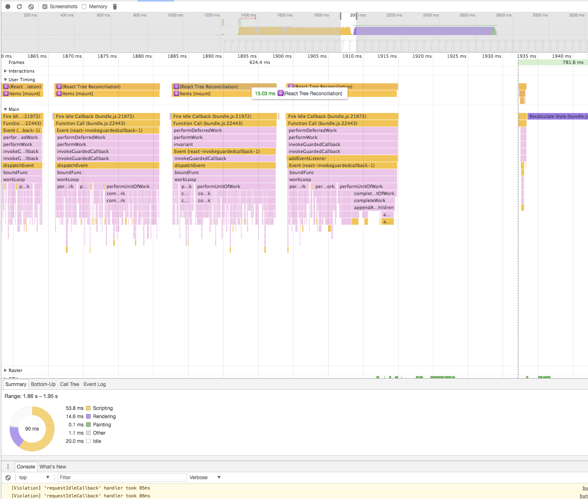

# React Fiber resources [](CONTRIBUTING.md#pull-requests)

This is for resources for React Fiber.

React Fiber is a new React reconciler algorithm.

## Try React Fiber asynchronous rendering!

You can try React Fiber asynchronous rendering by the following ways.

### 1. Use `ReactDOM.unstable_deferredUpdates`

Inside a `ReactDOM.unstable_deferredUpdates` callback, the updates are treated as Low Priority.

```js
ReactDOM.unstable_deferredUpdates(() => {
    ReactDOM.render(<App />. container);
    // or
    instance.setState(() => newState);
});
```

### 2. Use `React.unstable_AsyncComponent`

`React.unstable_AsyncComponent` makes updates in child components asynchronous, which means the updates are treated as Low Priority.

You can use `React.unstable_AsyncComponent` as just a component or as a base class like PureComponent.

```js
const AsyncComponent = React.unstable_AsyncComponent;

<AsyncComponent>
  <App /> // Low Priority by default
</AsyncComponent>

// Low Priority by default
const App extends AsyncComponent {
    render() {
        return <Child />
    }
}
```

If you'd like to use synchronous updates inside the component, you can use `ReactDOM.flushSync(cb)`.
In side a `ReactDOM.flushSync` callback, the updates are treated as Sync Priority, which is the default priority of v15.

```js
ReactDOM.flushSync(() => {
    // Sync Priority for use input or an animation etc
});
```

## Examples

If you can't get any diferrence between Async mode and Sync mode, you should use CPU throttling on Chrome :smile:

* https://koba04.github.io/react-fiber-resources/examples/

## How to contribute React Fiber

* https://github.com/facebook/react/issues/7925#issuecomment-259258900

## React internal algorithm

If you are not familiar with React internals, I recommend you to read the documentations, which are very helpful.

* [Codebase Overview](https://reactjs.org/docs/codebase-overview.html)
* [Implementation Notes](https://reactjs.org/docs/implementation-notes.html)

## React Fiber

* [ReactFiber](https://github.com/facebook/react/tree/master/packages/react-reconciler/src)
* [ReactFiberDOM](https://github.com/facebook/react/blob/master/packages/react-dom/src/client/ReactDOM.js)
* [Example](https://github.com/facebook/react/blob/master/fixtures/fiber-triangle/index.html)
* [Fiber Debugger](http://fiber-debugger.surge.sh/)

## Articles & Slides

* [React Fiber Architecture](https://github.com/acdlite/react-fiber-architecture)
* [Fiber Principles: Contributing To Fiber #7942](https://github.com/facebook/react/issues/7942)
* [How React Fiber Works](https://www.facebook.com/groups/2003630259862046/permalink/2054053404819731/)
* [React Internals](https://zackargyle.github.io/react-internals-slides/)
* [Capability of React Fiber](https://speakerdeck.com/koba04/capability-of-react-fiber)
* [A look inside React Fiber - how work will get done](http://makersden.io/blog/look-inside-fiber/)
* [Build your own React Fiber](https://engineering.hexacta.com/didact-fiber-incremental-reconciliation-b2fe028dcaec)

## Videos

* [Andrew Clark: Roadmap for React Fiber and Beyond](https://www.youtube.com/watch?v=QW5TE4vrklU)
* [The Evolution of React and GraphQL at Facebook and Beyond](https://developers.facebook.com/videos/f8-2017/the-evolution-of-react-and-graphql-at-facebook-and-beyond/)
* [Lin Clark - A Cartoon Intro to Fiber - React Conf 2017](https://www.youtube.com/watch?v=ZCuYPiUIONs)
* [Sebastian Markbåge - React Performance End to End (React Fiber)](https://www.youtube.com/watch?v=bvFpe5j9-zQ)
* [Andrew Clark: What's Next for React — ReactNext 2016](https://www.youtube.com/watch?v=aV1271hd9ew)
* [Why, What, and How of React Fiber with Dan Abramov and Andrew Clark](https://www.youtube.com/watch?v=crM1iRVGpGQ)
* [A tiny Fiber renderer](https://www.youtube.com/watch?v=U9zFfIww3Go)

## React Fiber function call stacks

**[Note]** React Fiber now behaves as synchronous by default. See [#8127](https://github.com/facebook/react/pull/8127).
This call stacks are results in the time when it behaved as asynchronous.

### ReactDOMFiber


### ReactDOM


### ReactDOMFiber with 10000 items (Async Scheduling)



```
--- working asynchronously using requestIdleCallback -------------------------------------------------
| ------- Fiber ---------------    ------- Fiber ---------------    ------ Fiber ---------------     |
| | beginWork -> completeWork | -> | beginWork -> completeWork | -> |beginWork -> completeWork | ... |
| -----------------------------   ------------------------------    ----------------------------     |
------------------------------------------------------------------------------------------------------
                      ↓↓↓
-----------------------------------------------------------------------
| commitAllWork(flush side effects computed in the above to the host) |
-----------------------------------------------------------------------
```

### ReactDOMFiber with 10000 items (Sync Scheduling)


### ReactDOM with 10000 items


## React Fiber call tree


## Related Words

* [Fiber](https://en.wikipedia.org/wiki/Fiber_(computer_science))
* [Call Stack](https://en.wikipedia.org/wiki/Call_stack)
* [Coroutine](https://en.wikipedia.org/wiki/Coroutine)
* [Continuation](https://en.wikipedia.org/wiki/Continuation)
* Algebraic Effects
  * [One-shot Delimited Continuations with Effect Handlers](https://esdiscuss.org/topic/one-shot-delimited-continuations-with-effect-handlers)
  * [Effective Concurrency with Algebraic Effects](http://kcsrk.info/ocaml/multicore/2015/05/20/effects-multicore/)
  * [Concurrent & Multicore OCaml: A deep dive](http://kcsrk.info/slides/multicore_fb16.pdf)

## Custom Renderer Interface

You should implement the following interface when create a custom fiber renderer.

* https://github.com/facebook/react/tree/master/packages/react-reconciler
* https://github.com/facebook/react/blob/master/packages/react-reconciler/src/ReactFiberReconciler.js

### Toy custom renderers

* https://github.com/koba04/react-fiber-resources/tree/master/toy-renderers

* Console Renderer

```js
ReactConsole.render(
  <>
    <red>Hello</red>
    <yellow>World</yellow>
    <cyan>React</cyan>
    <rainbow>Custom Renderer!</rainbow>
  </>,
  () => console.log(colors.inverse('##### Update ######'))
);
ReactConsole.render(
  <>
    <green>Hello</green>
    <yellow>World2</yellow>
    <cyan>React</cyan>
  </>
);
```

* Voice Renderer

```js
    ReactVoice.render(
      <>
        <alex>Hello</alex>
        <victoria>React Fiber</victoria>
      </>
    );
```

## ReactNoop

ReactNoop is a renderer for React Fiber, which is using for testing and debugging.
It is very useful to understand React Fiber renderer!! :eyes:

* https://github.com/facebook/react/tree/master/packages/react-noop-renderer

Bonus: You should watch `ReactIncremental-test.internal.js`, which helps to understand what React Fiber makes it possible

* https://github.com/facebook/react/blob/master/packages/react-reconciler/src/__tests__/ReactIncremental-test.internal.js
